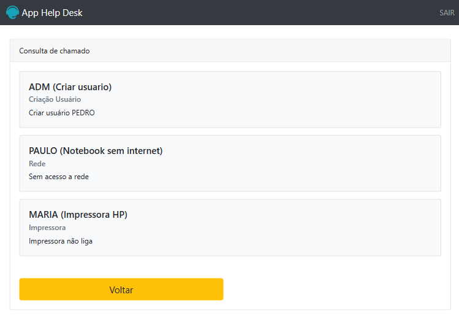

<h1 align="center">App Help Desk</h1>



O App Help Desk é um sistema implementado em PHP para abertura de chamados em um suporte de informática. Permite o cadastro de usuários e a abertura de chamados técnicos. Cada usuário pode visualizar apenas seus próprios chamados, enquanto usuários administradores têm acesso a todos os chamados abertos.

## Funcionalidades

- Cadastro de usuário com e-mail, CPF e senha.
- Abertura de chamados técnicos.
- Acesso restrito para cada usuário aos seus próprios chamados.
- Acesso administrativo para visualização de todos os chamados.

## Requisitos

- PHP 7.x ou superior
- MySQL (ou outro banco de dados compatível com PHP)
- Servidor Web (ex: Apache, Nginx)

## Instalação

1. Clone este repositório:

```bash
git clone https://github.com/paulovitorguedes/app_help_desk.git
```
2. Importe o arquivo de banco de dados ```database.sql``` para criar a estrutura inicial do banco de dados.

3. Configure as credenciais de acesso ao banco de dados no arquivo ```config.php```.

4. Inicie o servidor web e abra o sistema no navegador.


## Contribuindo

Contribuições são bem-vindas! Se você deseja melhorar este projeto, sinta-se à vontade para abrir um problema ou enviar uma solicitação de pull request.

## Licença

Este projeto está licenciado sob a [MIT License](https://opensource.org/licenses/MIT).
